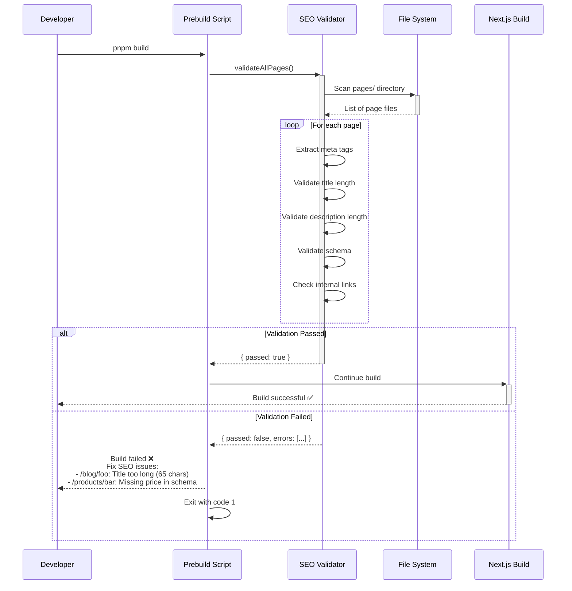
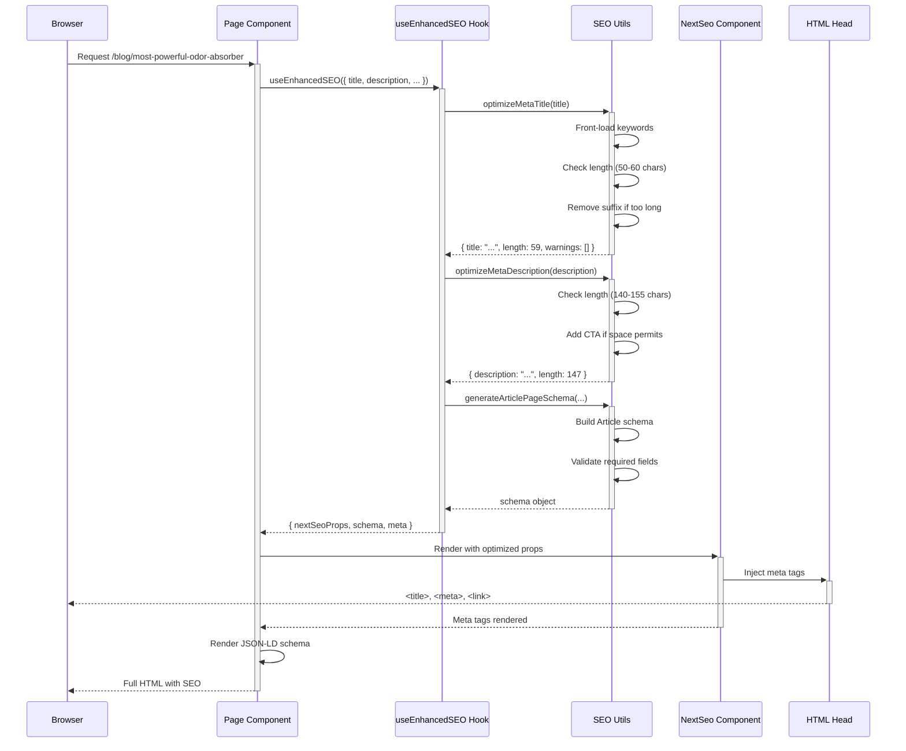
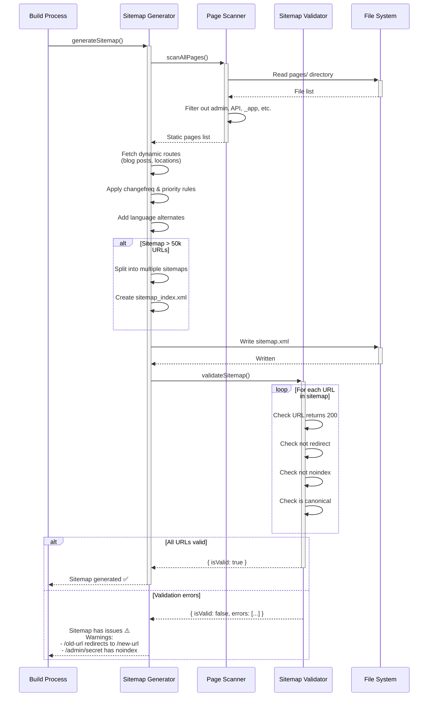
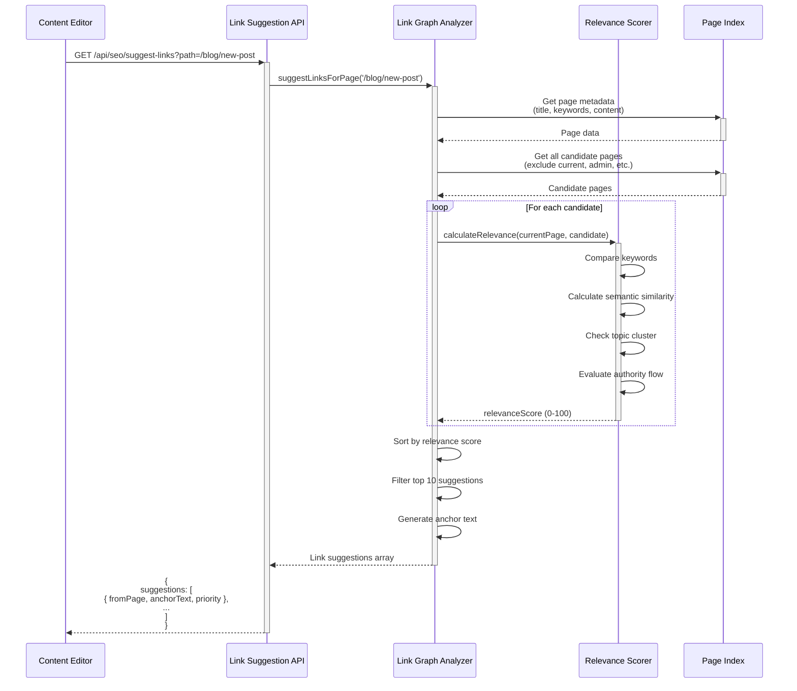

# SEO Transformation Architecture Design

## Executive Summary

This design leverages existing SEO infrastructure (`src/lib/seo-utils.ts`, NextSeo, structured data components) while adding new validation, optimization, and automation layers to fix 63 critical SEO issues and achieve 30-50x traffic growth.

**Design Principles:**
1. **Backward Compatibility**: All changes preserve existing SEO patterns
2. **Validation-First**: Automated validation prevents regressions
3. **Centralized Logic**: All SEO logic in `src/lib/seo-utils.ts`
4. **Build-Time Optimization**: Most validation/generation happens at build time
5. **Incremental Adoption**: Pages can opt-in to enhanced SEO features

---

## System Architecture

### High-Level Architecture Diagram

```
┌─────────────────────────────────────────────────────────────────┐
│                         BUILD TIME                               │
├─────────────────────────────────────────────────────────────────┤
│                                                                   │
│  ┌─────────────────┐      ┌──────────────────┐                  │
│  │ Meta Optimizer  │──────▶ Validate Lengths  │                  │
│  │ (seo-utils.ts)  │      │ - Title 50-60ch   │                  │
│  └─────────────────┘      │ - Desc 140-155ch  │                  │
│           │               └──────────────────┘                  │
│           │                                                       │
│           ▼                                                       │
│  ┌─────────────────┐      ┌──────────────────┐                  │
│  │ Schema Generator│──────▶ Validate Schema   │                  │
│  │ (seo-utils.ts)  │      │ - Required fields │                  │
│  └─────────────────┘      │ - Rich Results    │                  │
│           │               │ - Schema.org      │                  │
│           │               └──────────────────┘                  │
│           ▼                                                       │
│  ┌─────────────────┐      ┌──────────────────┐                  │
│  │ Sitemap Builder │──────▶ Validate Sitemap  │                  │
│  │ (dynamic)       │      │ - All pages       │                  │
│  └─────────────────┘      │ - No 404s         │                  │
│           │               │ - No redirects    │                  │
│           │               └──────────────────┘                  │
│           ▼                                                       │
│  ┌─────────────────┐                                             │
│  │ Link Analyzer   │  Scans all pages for:                       │
│  │ (build-time)    │  - Orphan pages (0 links)                   │
│  └─────────────────┘  - Weak pages (1 link)                      │
│           │           - Broken links                              │
│           │                                                       │
│           ▼                                                       │
│  ┌─────────────────┐                                             │
│  │ Validation Gate │  BLOCKS BUILD if:                           │
│  │ (prebuild)      │  - Title/desc too long                      │
│  └─────────────────┘  - Schema validation fails                  │
│                       - Critical broken links                    │
└─────────────────────────────────────────────────────────────────┘

┌─────────────────────────────────────────────────────────────────┐
│                         RUNTIME                                  │
├─────────────────────────────────────────────────────────────────┤
│                                                                   │
│  ┌─────────────────┐                                             │
│  │  Page Component │                                             │
│  │  (any .tsx)     │                                             │
│  └────────┬────────┘                                             │
│           │                                                       │
│           ▼                                                       │
│  ┌─────────────────┐      ┌──────────────────┐                  │
│  │ useEnhancedSEO()│──────▶ normalizeMetaTitle│                  │
│  │ Hook            │      │ normalizeMetaDesc │                  │
│  └─────────────────┘      └──────────────────┘                  │
│           │                                                       │
│           ▼                                                       │
│  ┌─────────────────┐                                             │
│  │   NextSeo       │  Renders:                                   │
│  │   Component     │  - Meta tags                                │
│  └─────────────────┘  - OG tags                                  │
│           │           - Twitter cards                            │
│           │                                                       │
│           ▼                                                       │
│  ┌─────────────────┐                                             │
│  │ JSONLDSchema    │  Renders:                                   │
│  │ Component       │  - Product schema                           │
│  └─────────────────┘  - Article schema                           │
│                       - FAQ schema                               │
│                       - Breadcrumb schema                        │
└─────────────────────────────────────────────────────────────────┘
```

---

## Component Design

### 1. Enhanced SEO Utilities (`src/lib/seo/enhanced-seo-utils.ts`)

**Purpose**: Extension of existing `seo-utils.ts` with validation and optimization

**New Functions:**

```typescript
/**
 * Validates and optimizes meta title with smart truncation
 * - Front-loads keywords
 * - Removes suffix if too long
 * - Adds ellipsis if truncated
 */
export function optimizeMetaTitle(
  title: string,
  targetKeyword?: string,
  locale?: LocaleCode
): {
  title: string;
  isTruncated: boolean;
  length: number;
  warnings: string[];
}

/**
 * Validates and optimizes meta description
 * - Ensures benefit-driven language
 * - Adds CTA if space permits
 * - Optimizes for featured snippets
 */
export function optimizeMetaDescription(
  description: string,
  targetKeyword?: string,
  locale?: LocaleCode
): {
  description: string;
  isTruncated: boolean;
  length: number;
  warnings: string[];
}

/**
 * Validates structured data against Google Rich Results requirements
 * Returns validation errors that would prevent rich results
 */
export function validateStructuredData(
  schema: object,
  schemaType: 'Product' | 'Article' | 'FAQ' | 'Organization'
): {
  isValid: boolean;
  errors: Array<{ field: string; message: string; severity: 'error' | 'warning' }>;
  richResultsEligible: boolean;
}

/**
 * Generates optimized internal link suggestions for a page
 * Based on semantic similarity, keyword relevance, authority flow
 */
export function generateInternalLinkSuggestions(
  currentPage: {
    path: string;
    title: string;
    keywords: string[];
    content: string;
  },
  allPages: Array<{
    path: string;
    title: string;
    keywords: string[];
  }>
): Array<{
  targetPath: string;
  anchorText: string;
  relevanceScore: number;
  reason: string;
}>

/**
 * Validates that Open Graph URL matches canonical URL
 */
export function validateOGCanonicalMatch(
  canonicalUrl: string,
  ogUrl: string
): { matches: boolean; issue?: string }
```

**Integration with Existing Code:**
- Import and wrap existing `normalizeMetaTitle()` and `normalizeMetaDescription()`
- Add validation layer before existing functions
- Export enhanced versions for use in components

---

### 2. SEO Validation System

#### 2.1 Pre-Build Validation Script (`scripts/seo/validate-seo-compliance.ts`)

**Purpose**: Runs before build to catch SEO issues early

**Architecture:**

```typescript
/**
 * Validates ALL pages before build
 * Fails build if critical errors found
 */
export async function validateAllPages(): Promise<{
  passed: boolean;
  errors: ValidationError[];
  warnings: ValidationWarning[];
  stats: {
    totalPages: number;
    pagesWithErrors: number;
    pagesWithWarnings: number;
    orphanPages: number;
    brokenLinks: number;
  };
}>

interface ValidationError {
  page: string;
  severity: 'critical' | 'error' | 'warning';
  type: 'meta' | 'schema' | 'links' | 'images' | 'sitemap';
  field: string;
  message: string;
  fix?: string; // Auto-fix suggestion
}
```

**Validation Rules:**

```typescript
const VALIDATION_RULES = {
  meta: {
    titleMinLength: 40,
    titleMaxLength: 60,
    titleMustHaveKeyword: true,
    descriptionMinLength: 140,
    descriptionMaxLength: 155,
    descriptionMustHaveBenefit: true,
  },
  schema: {
    productMustHavePrice: true,
    productMustHaveAvailability: true,
    productMustHaveImage: true,
    productMustHaveRating: false, // Warning only
    articleMustHaveDatePublished: true,
    articleMustHaveAuthor: true,
    faqMinQuestions: 2,
  },
  links: {
    minInternalLinksPerPage: 3,
    maxInternalLinksPerPage: 50,
    orphanPagesAllowed: 0,
    brokenLinksAllowed: 0,
  },
  openGraph: {
    ogUrlMustMatchCanonical: true,
    ogImageMustExist: true,
    ogImageMinWidth: 1200,
    ogImageMinHeight: 630,
  },
};
```

**Usage:**

```json
// package.json
{
  "scripts": {
    "prebuild": "tsx scripts/seo/validate-seo-compliance.ts --fail-on-error"
  }
}
```

#### 2.2 Runtime Validation Hook (`src/hooks/useEnhancedSEO.ts`)

**Purpose**: Provides optimized SEO data with runtime warnings in dev mode

```typescript
/**
 * Enhanced SEO hook with validation and optimization
 * Use this instead of manually configuring NextSeo
 */
export function useEnhancedSEO(config: SEOConfig): EnhancedSEOResult {
  const { locale } = useTranslation();
  const { currency } = useCurrency();

  // Optimize meta tags
  const optimizedTitle = optimizeMetaTitle(config.title, config.targetKeyword, locale);
  const optimizedDescription = optimizeMetaDescription(
    config.description,
    config.targetKeyword,
    locale
  );

  // Validate in development
  if (process.env.NODE_ENV === 'development') {
    const warnings = [
      ...optimizedTitle.warnings,
      ...optimizedDescription.warnings,
    ];
    if (warnings.length > 0) {
      console.warn(`[SEO] ${config.path}:`, warnings);
    }
  }

  // Generate structured data with validation
  const schema = config.schemaType
    ? generateValidatedSchema(config.schemaType, config.schemaData, locale, currency)
    : null;

  return {
    nextSeoProps: {
      title: optimizedTitle.title,
      description: optimizedDescription.description,
      canonical: getLocalizedUrl(config.path, locale),
      // ... full NextSeo config
    },
    schema,
    meta: {
      titleLength: optimizedTitle.length,
      descriptionLength: optimizedDescription.description,
      isTitleTruncated: optimizedTitle.isTruncated,
      isDescriptionTruncated: optimizedDescription.isTruncated,
    },
  };
}

interface SEOConfig {
  path: string;
  title: string;
  description: string;
  targetKeyword?: string;
  schemaType?: 'product' | 'article' | 'faq' | 'location';
  schemaData?: Record<string, any>;
  image?: string;
  keywords?: string[];
}
```

---

### 3. Dynamic Sitemap Generation System

#### 3.1 Enhanced Sitemap Generator (`scripts/seo/generate-enhanced-sitemap.ts`)

**Purpose**: Generates comprehensive sitemap with ALL indexable pages

**Architecture:**

```typescript
/**
 * Scans entire pages/ directory and generates sitemap
 * Excludes: admin pages, API routes, noindex pages
 */
export async function generateSitemap(): Promise<{
  urls: SitemapURL[];
  excluded: Array<{ path: string; reason: string }>;
  stats: SitemapStats;
}>

interface SitemapURL {
  loc: string;
  lastmod: string;
  changefreq: 'always' | 'hourly' | 'daily' | 'weekly' | 'monthly' | 'yearly' | 'never';
  priority: number;
  alternates?: Array<{ hrefLang: string; href: string }>;
}

interface SitemapStats {
  totalPages: number;
  indexablePages: number;
  excludedPages: number;
  blogPosts: number;
  productPages: number;
  learnPages: number;
  locationPages: number;
}
```

**Page Discovery Logic:**

```typescript
const PAGE_SCAN_RULES = {
  include: [
    'pages/**/*.tsx',
    '!pages/api/**',       // Exclude API routes
    '!pages/admin/**',     // Exclude admin
    '!pages/_*.tsx',       // Exclude Next.js internals
    '!pages/404.tsx',      // Exclude error pages
    '!pages/500.tsx',
    '!pages/**/[...*.tsx', // Exclude catch-all routes (handle separately)
  ],

  dynamicRoutes: {
    // Handle dynamic routes separately
    blog: async () => {
      const posts = await getBlogPosts();
      return posts.map(p => `/blog/${p.slug}`);
    },
    locations: async () => {
      const cities = await getCities();
      return cities.map(c => `/locations/${c.slug}`);
    },
  },

  noindex: [
    '/offline',
    '/sentry-example-page',
    '/dialergptpitchdeck',
    '/customer/portal',
    '/affiliate/dashboard',
  ],
};
```

**Changefreq & Priority Optimization:**

```typescript
const PAGE_METADATA = {
  '/': { changefreq: 'daily', priority: 1.0 },
  '/products/*': { changefreq: 'weekly', priority: 0.9 },
  '/blog/*': { changefreq: 'weekly', priority: 0.8 },
  '/learn/*': { changefreq: 'monthly', priority: 0.7 },
  '/locations/*': { changefreq: 'monthly', priority: 0.6 },
  // Default for unlisted pages
  default: { changefreq: 'monthly', priority: 0.5 },
};
```

**Sitemap Splitting (if > 50k URLs):**

```typescript
/**
 * Splits sitemap into multiple files if needed
 * Creates sitemap_index.xml that references all sitemaps
 */
export async function generateSitemapIndex(sitemaps: string[]): Promise<string>
```

#### 3.2 Sitemap Validation (`scripts/seo/validate-sitemap.ts`)

**Purpose**: Validates sitemap contains NO broken links, redirects, or noindex pages

```typescript
/**
 * Validates sitemap integrity
 */
export async function validateSitemap(): Promise<{
  isValid: boolean;
  errors: Array<{
    url: string;
    issue: 'redirect' | '404' | 'noindex' | 'non-canonical' | 'slow';
    details: string;
  }>;
}>

// Validation checks:
// 1. All URLs return 200 status
// 2. No URLs redirect (301/302)
// 3. No URLs have noindex meta tag
// 4. All URLs match canonical version
// 5. No duplicate URLs
// 6. All hreflang URLs exist and return 200
```

---

### 4. Internal Linking System

#### 4.1 Link Graph Analyzer (`src/lib/seo/link-graph-analyzer.ts`)

**Purpose**: Analyzes internal linking structure and identifies issues

**Architecture:**

```typescript
/**
 * Builds internal link graph from all pages
 */
export class LinkGraphAnalyzer {
  private graph: Map<string, Set<string>>; // page -> outgoing links
  private reverseGraph: Map<string, Set<string>>; // page -> incoming links

  /**
   * Scans all pages and builds link graph
   */
  async buildGraph(pages: string[]): Promise<void>

  /**
   * Finds orphan pages (0 incoming links)
   */
  findOrphanPages(): string[]

  /**
   * Finds weak pages (1 incoming link)
   */
  findWeakPages(): Array<{ page: string; incomingFrom: string }>

  /**
   * Finds pages with no outgoing links (dead ends)
   */
  findDeadEndPages(): string[]

  /**
   * Calculates PageRank-style authority score for each page
   */
  calculatePageAuthority(): Map<string, number>

  /**
   * Suggests internal links for a page based on:
   * - Semantic similarity (keyword overlap)
   * - Topic clustering
   * - Authority flow optimization
   */
  suggestLinksForPage(page: string): Array<{
    targetPage: string;
    anchorText: string;
    reason: string;
    priority: 'high' | 'medium' | 'low';
  }>
}
```

**Link Extraction:**

```typescript
/**
 * Extracts internal links from a page
 * Handles: <Link>, <a>, dynamic routes
 */
export function extractInternalLinks(
  pageContent: string,
  pagePath: string
): Array<{
  targetPath: string;
  anchorText: string;
  context: string; // Surrounding text for relevance analysis
}>
```

#### 4.2 Auto-Linking Component (`src/components/seo/AutoLinkedContent.tsx`)

**Purpose**: Automatically adds contextual internal links to content

```typescript
/**
 * Wraps content and intelligently adds internal links
 * Based on keyword matching and relevance
 */
export function AutoLinkedContent({
  content,
  currentPath,
  maxLinks = 5,
}: {
  content: string;
  currentPath: string;
  maxLinks?: number;
}) {
  // 1. Parse content into paragraphs
  // 2. Identify keyword phrases
  // 3. Match with internal pages
  // 4. Insert links (max 1 per paragraph, prioritize first occurrence)
  // 5. Track added links to avoid over-linking
}
```

**Link Suggestion Strategy:**

```typescript
const LINK_STRATEGY = {
  blog: {
    // Blog posts should link to:
    linkTo: ['product', 'learn', 'related-blog'],
    minLinks: 3,
    maxLinks: 8,
    anchorStrategy: 'keyword-rich', // Use target keywords as anchor text
  },
  learn: {
    linkTo: ['product', 'blog', 'faq'],
    minLinks: 5,
    maxLinks: 10,
    anchorStrategy: 'descriptive',
  },
  product: {
    linkTo: ['learn', 'blog', 'related-product'],
    minLinks: 3,
    maxLinks: 6,
    anchorStrategy: 'benefit-driven',
  },
};
```

---

### 5. Schema Validation System

#### 5.1 Schema Validator (`src/lib/seo/schema-validator.ts`)

**Purpose**: Validates structured data against Google requirements

**Architecture:**

```typescript
/**
 * Validates Product schema for Google Shopping
 */
export function validateProductSchema(schema: ProductSchema): ValidationResult {
  const errors: ValidationError[] = [];

  // Required fields for Google Shopping
  if (!schema.offers?.price) {
    errors.push({
      field: 'offers.price',
      message: 'Price is required for product rich results',
      severity: 'error',
      fix: 'Add price to Product offers',
    });
  }

  if (!schema.offers?.priceCurrency) {
    errors.push({
      field: 'offers.priceCurrency',
      message: 'Currency is required',
      severity: 'error',
    });
  }

  // Validate price format
  if (typeof schema.offers?.price === 'string') {
    const price = parseFloat(schema.offers.price);
    if (isNaN(price) || price <= 0) {
      errors.push({
        field: 'offers.price',
        message: 'Price must be a positive number',
        severity: 'error',
      });
    }
  }

  // Validate availability URL
  if (schema.offers?.availability) {
    if (!schema.offers.availability.startsWith('https://schema.org/')) {
      errors.push({
        field: 'offers.availability',
        message: 'Availability must be a schema.org URL',
        severity: 'error',
        fix: 'Use buildAvailabilityUrl() helper',
      });
    }
  }

  // Validate image
  if (!schema.image || schema.image.length === 0) {
    errors.push({
      field: 'image',
      message: 'At least one image is required',
      severity: 'error',
    });
  }

  // Validate image URLs return 200
  // (Can be async validation during build)

  // Validate aggregateRating
  if (schema.aggregateRating) {
    if (!schema.aggregateRating.ratingValue) {
      errors.push({
        field: 'aggregateRating.ratingValue',
        message: 'Rating value is required if aggregateRating is present',
        severity: 'error',
      });
    }
    if (!schema.aggregateRating.reviewCount) {
      errors.push({
        field: 'aggregateRating.reviewCount',
        message: 'Review count is required if aggregateRating is present',
        severity: 'error',
      });
    }
  }

  return {
    isValid: errors.filter(e => e.severity === 'error').length === 0,
    errors,
    warnings: errors.filter(e => e.severity === 'warning'),
  };
}

/**
 * Validates Article schema
 */
export function validateArticleSchema(schema: ArticleSchema): ValidationResult

/**
 * Validates FAQ schema
 */
export function validateFAQSchema(schema: FAQSchema): ValidationResult

/**
 * External validation via Google Rich Results Test API
 * (If available - may need to use headless browser)
 */
export async function validateWithGoogleAPI(
  url: string
): Promise<{
  isValid: boolean;
  richResultTypes: string[];
  errors: Array<{ type: string; message: string }>;
}>
```

#### 5.2 Enhanced Schema Generation

**Modify existing schema functions to use currency context:**

```typescript
// BEFORE (in src/lib/seo-utils.ts):
export const generateProductStructuredData = (productId: string, localeInput: string) => {
  // ...
  priceCurrency: 'CAD', // ❌ Hardcoded
}

// AFTER (enhanced):
export const generateProductStructuredData = (
  productId: string,
  localeInput: string,
  currency: 'CAD' | 'USD' = 'CAD' // ✅ Dynamic
) => {
  // ...
  priceCurrency: currency,
  price: getProductPrice(productId, currency).toFixed(2), // Use correct price
}
```

**Add image dimensions to all schemas:**

```typescript
// Enhanced product schema with image dimensions
image: [
  {
    '@type': 'ImageObject',
    url: `${baseUrl}${product.image}`,
    width: 1200,  // ✅ Required for rich results
    height: 800,  // ✅ Required for rich results
  }
],
```

**Add missing schema types:**

```typescript
/**
 * Generate HowTo schema for instructional content
 */
export function generateHowToSchema(
  title: string,
  steps: Array<{ name: string; text: string; image?: string }>,
  locale: LocaleCode
): HowToSchema

/**
 * Generate Review schema for testimonials
 */
export function generateReviewSchema(
  itemReviewed: { name: string; type: string },
  reviews: Array<{
    author: string;
    rating: number;
    reviewBody: string;
    datePublished: string;
  }>,
  locale: LocaleCode
): ReviewSchema
```

---

### 6. Meta Content Optimization System

#### 6.1 Translation Enhancement (`src/translations/seo-meta.ts`)

**Purpose**: Centralized SEO meta content for all pages

**Structure:**

```typescript
export const SEO_META = {
  en: {
    homepage: {
      title: "Stop Cat Litter Smell Instantly - Activated Carbon Odor Eliminator",
      description: "No more embarrassing cat smell! Our activated carbon eliminates 99% of ammonia odor in 30 seconds. Guests will think you don't have cats. Free trial + free shipping.",
      targetKeyword: "cat litter smell",
    },
    products: {
      trial: {
        title: "FREE Cat Litter Deodorizer Trial - Just Pay $4.76 Shipping",
        description: "Try our #1 activated carbon cat litter additive FREE. Eliminates ammonia smell instantly. See why 10,000+ customers love Purrify. Just pay shipping.",
        targetKeyword: "free cat litter deodorizer",
      },
      // ... all products
    },
    blog: {
      odorAbsorber: {
        title: "Most Powerful Cat Litter Odor Absorber [Tested 12 Products]",
        description: "We tested 12 odor eliminators. Only 1 removed ammonia smell in 30 seconds. See the shocking results and learn which works best for apartments.",
        targetKeyword: "most powerful odor absorber",
      },
      // ... all blog posts
    },
    learn: {
      howItWorks: {
        title: "How Activated Carbon Eliminates Cat Litter Smell [Science]",
        description: "Discover how water-filter grade activated carbon traps ammonia molecules at the source. Stop masking odors - eliminate them permanently with science.",
        targetKeyword: "how activated carbon works",
      },
      // ... all learn pages
    },
  },
  fr: {
    // French translations
  },
  zh: {
    // Chinese translations
  },
};
```

**Integration:**

```typescript
// In page components:
import { SEO_META } from '@/translations/seo-meta';
import { useTranslation } from '@/lib/translation-context';

export default function TrialSizePage() {
  const { locale } = useTranslation();
  const seo = SEO_META[locale].products.trial;

  return (
    <NextSeo
      title={seo.title}
      description={seo.description}
      // ...
    />
  );
}
```

#### 6.2 Meta Content Validator

**Purpose**: Ensures all meta content meets quality standards

```typescript
/**
 * Validates meta content quality
 */
export function validateMetaContent(
  title: string,
  description: string,
  targetKeyword?: string
): {
  isValid: boolean;
  score: number; // 0-100
  suggestions: string[];
} {
  const suggestions: string[] = [];
  let score = 100;

  // Title validation
  if (!targetKeyword || !title.toLowerCase().includes(targetKeyword.toLowerCase())) {
    suggestions.push(`Include target keyword "${targetKeyword}" in title`);
    score -= 20;
  }

  // Check for benefit-driven language
  const benefitWords = ['stop', 'eliminate', 'instant', 'free', 'proven', 'guaranteed'];
  const hasBenefit = benefitWords.some(word =>
    title.toLowerCase().includes(word) || description.toLowerCase().includes(word)
  );
  if (!hasBenefit) {
    suggestions.push('Add benefit-driven words (stop, eliminate, instant, etc.)');
    score -= 15;
  }

  // Check for numbers (proven to increase CTR)
  const hasNumber = /\d+/.test(title) || /\d+/.test(description);
  if (!hasNumber) {
    suggestions.push('Consider adding numbers for credibility (e.g., "99% effective", "10,000+ customers")');
    score -= 10;
  }

  // Check for year (freshness signal)
  const currentYear = new Date().getFullYear();
  const hasYear = title.includes(String(currentYear)) || description.includes(String(currentYear));
  if (!hasYear) {
    suggestions.push(`Add current year (${currentYear}) for freshness`);
    score -= 5;
  }

  // Check description has CTA
  const ctaWords = ['try', 'get', 'shop', 'buy', 'learn', 'discover', 'see'];
  const hasCTA = ctaWords.some(word => description.toLowerCase().includes(word));
  if (!hasCTA) {
    suggestions.push('Add call-to-action to description');
    score -= 10;
  }

  return {
    isValid: score >= 70,
    score,
    suggestions,
  };
}
```

---

### 7. Image Optimization & Validation

#### 7.1 Image SEO Validator (`scripts/seo/validate-image-seo.ts`)

**Purpose**: Ensures all images meet SEO requirements

```typescript
/**
 * Validates image SEO compliance
 */
export async function validateImageSEO(): Promise<{
  passed: boolean;
  issues: Array<{
    image: string;
    issue: 'missing-alt' | 'broken' | 'too-large' | 'wrong-format' | 'no-dimensions';
    details: string;
  }>;
}> {
  const issues: ImageIssue[] = [];

  // 1. Check all <Image> components have alt text
  // 2. Check all images return 200 status
  // 3. Check image file sizes within limits
  // 4. Check WebP format for modern browsers
  // 5. Check OG images are at least 1200x630

  return { passed: issues.length === 0, issues };
}
```

**OG Image Requirements:**

```typescript
const OG_IMAGE_REQUIREMENTS = {
  minWidth: 1200,
  minHeight: 630,
  maxFileSize: 8 * 1024 * 1024, // 8MB (Facebook limit)
  aspectRatio: { min: 1.91, max: 1.91 }, // 1.91:1 for optimal display
  formats: ['png', 'jpg', 'webp'],
};
```

---

### 8. Redirect Management System

#### 8.1 Redirect Manager (`src/lib/seo/redirect-manager.ts`)

**Purpose**: Centralized redirect configuration

```typescript
/**
 * Centralized redirect configuration
 * All redirects defined here for easy management
 */
export const REDIRECTS: Array<{
  source: string;
  destination: string;
  permanent: boolean; // 301 vs 302
  reason?: string; // Documentation
}> = [
  {
    source: '/old-blog-post',
    destination: '/blog/new-blog-post',
    permanent: true,
    reason: 'URL structure change 2025-01',
  },
  // ... all redirects
];

/**
 * Validates no redirect chains exist
 */
export function validateNoRedirectChains(): {
  hasChains: boolean;
  chains: Array<{
    path: string[];
    fix: string;
  }>;
}

/**
 * Generates next.config.js redirects from REDIRECTS array
 */
export function generateNextConfigRedirects(): NextRedirect[]
```

**Integration with next.config.js:**

```javascript
// next.config.js
const { generateNextConfigRedirects } = require('./src/lib/seo/redirect-manager');

module.exports = {
  async redirects() {
    return generateNextConfigRedirects();
  },
};
```

---

## Data Models

### SEO Metadata Model

```typescript
interface PageSEOMetadata {
  path: string;
  locale: LocaleCode;

  // Meta tags
  title: string;
  titleLength: number;
  description: string;
  descriptionLength: number;
  keywords: string[];
  targetKeyword?: string;

  // Canonical & alternates
  canonicalUrl: string;
  languageAlternates: LanguageAlternate[];

  // Open Graph
  ogTitle: string;
  ogDescription: string;
  ogUrl: string;
  ogImage: {
    url: string;
    width: number;
    height: number;
    alt: string;
  };
  ogType: 'website' | 'article' | 'product';
  ogLocale: string;

  // Twitter
  twitterCard: 'summary' | 'summary_large_image';
  twitterSite: string;
  twitterTitle: string;
  twitterDescription: string;
  twitterImage: string;

  // Structured data
  schemas: Array<{
    type: string;
    data: object;
  }>;

  // Internal linking
  internalLinks: Array<{
    targetPath: string;
    anchorText: string;
  }>;

  // Validation status
  validation: {
    isValid: boolean;
    errors: ValidationError[];
    warnings: ValidationWarning[];
    lastValidated: string;
  };
}
```

### Sitemap Entry Model

```typescript
interface SitemapEntry {
  loc: string;
  lastmod: string;
  changefreq: 'always' | 'hourly' | 'daily' | 'weekly' | 'monthly' | 'yearly' | 'never';
  priority: number;

  // Internationalization
  alternates: Array<{
    hrefLang: string;
    href: string;
  }>;

  // Metadata for management
  pageType: 'homepage' | 'product' | 'blog' | 'learn' | 'location' | 'other';
  isIndexable: boolean;
  hasNoindex: boolean;
  statusCode?: number;
}
```

### Link Graph Model

```typescript
interface LinkGraphNode {
  path: string;
  incomingLinks: Array<{
    fromPath: string;
    anchorText: string;
  }>;
  outgoingLinks: Array<{
    toPath: string;
    anchorText: string;
  }>;

  // Metrics
  authorityScore: number; // PageRank-style score
  incomingLinkCount: number;
  outgoingLinkCount: number;

  // Flags
  isOrphan: boolean; // 0 incoming links
  isWeak: boolean; // 1 incoming link
  isDeadEnd: boolean; // 0 outgoing links
}
```

---

## API Design

### SEO Validation API (`pages/api/seo/validate.ts`)

**Purpose**: On-demand SEO validation for specific pages

```typescript
// POST /api/seo/validate
{
  "path": "/blog/most-powerful-odor-absorber",
  "locale": "en",
  "checks": ["meta", "schema", "links", "images"]
}

// Response:
{
  "isValid": true,
  "results": {
    "meta": {
      "passed": true,
      "title": {
        "value": "Most Powerful Cat Litter Odor Absorber [Tested 12 Products]",
        "length": 59,
        "isOptimal": true
      },
      "description": {
        "value": "We tested 12 odor eliminators...",
        "length": 147,
        "isOptimal": true
      }
    },
    "schema": {
      "passed": true,
      "types": ["Article", "FAQPage"],
      "richResultsEligible": true
    },
    "links": {
      "passed": false,
      "incomingLinks": 1, // ❌ Too few
      "outgoingLinks": 8,
      "suggestions": [...]
    },
    "images": {
      "passed": true,
      "imagesChecked": 5,
      "allHaveAlt": true
    }
  },
  "suggestions": [
    "Add 2-4 more internal links pointing to this page"
  ]
}
```

### Internal Link Suggestions API (`pages/api/seo/suggest-links.ts`)

**Purpose**: Get link suggestions for a page

```typescript
// GET /api/seo/suggest-links?path=/blog/most-powerful-odor-absorber

// Response:
{
  "currentPage": "/blog/most-powerful-odor-absorber",
  "suggestions": [
    {
      "fromPage": "/blog/cat-litter-smell-worse-summer",
      "anchorText": "most powerful odor absorber",
      "reason": "High keyword relevance (85% match)",
      "priority": "high",
      "estimatedTrafficImpact": "+15%"
    },
    {
      "fromPage": "/learn/activated-carbon-benefits",
      "anchorText": "which odor absorber is most effective",
      "reason": "Topic cluster connection",
      "priority": "medium",
      "estimatedTrafficImpact": "+8%"
    }
  ]
}
```

---

## Sequence Diagrams

### 1. Build-Time SEO Validation Flow



### 2. Runtime Page Rendering with Enhanced SEO



### 3. Sitemap Generation Flow



### 4. Internal Link Suggestion Flow



---

## File Structure

```
src/
├── lib/
│   ├── seo/
│   │   ├── enhanced-seo-utils.ts       # Extended SEO utilities
│   │   ├── schema-validator.ts         # Schema validation logic
│   │   ├── link-graph-analyzer.ts      # Internal linking analysis
│   │   ├── redirect-manager.ts         # Centralized redirects
│   │   └── meta-optimizer.ts           # Meta tag optimization
│   └── seo-utils.ts                    # Existing (keep for compatibility)
│
├── hooks/
│   └── useEnhancedSEO.ts               # Runtime SEO hook
│
├── components/
│   └── seo/
│       ├── AutoLinkedContent.tsx       # Auto internal linking
│       └── json-ld-schema.tsx          # Existing schema component
│
├── translations/
│   ├── seo-meta.ts                     # Centralized SEO meta content
│   ├── en.ts                           # Existing translations
│   ├── fr.ts
│   └── zh.ts
│
scripts/
├── seo/
│   ├── validate-seo-compliance.ts      # Pre-build validation (NEW)
│   ├── generate-enhanced-sitemap.ts    # Dynamic sitemap generator (NEW)
│   ├── validate-sitemap.ts             # Sitemap validation (NEW)
│   ├── validate-image-seo.ts           # Image SEO validation (NEW)
│   ├── analyze-link-graph.ts           # Link graph analysis (NEW)
│   └── fix-seo-issues.ts               # Auto-fix common issues (NEW)
│
pages/
├── api/
│   └── seo/
│       ├── validate.ts                 # SEO validation API (NEW)
│       └── suggest-links.ts            # Link suggestion API (NEW)
│
.specs/
└── seo-transformation/
    ├── requirements.md                 # This spec
    ├── design.md                       # This document
    └── tasks.md                        # Implementation tasks (next phase)
```

---

## Technology Stack

### Core Technologies (Existing)
- **Next.js 16** (Pages Router) - SSG/SSR
- **React 19** - Component framework
- **TypeScript** - Type safety
- **next-seo** - SEO component library
- **Tailwind CSS** - Styling

### SEO-Specific Libraries (Existing)
- **next-sitemap** - Sitemap generation
- **@types/node** - Node.js types

### New Dependencies (To Add)
```json
{
  "dependencies": {
    "cheerio": "^1.0.0-rc.12",          // HTML parsing for link extraction
    "fast-glob": "^3.3.2",               // Fast file scanning
    "ajv": "^8.12.0",                    // JSON schema validation
    "ajv-formats": "^2.1.1"              // Schema.org format validation
  },
  "devDependencies": {
    "puppeteer": "^21.6.0",              // Google Rich Results Test automation
    "lighthouse": "^11.4.0",             // Performance auditing
    "html-validate": "^8.7.4"            // HTML validation
  }
}
```

---

## Integration Points

### 1. Existing SEO Utils Integration

**Enhanced functions wrap existing functions:**

```typescript
// src/lib/seo/enhanced-seo-utils.ts
import {
  normalizeMetaTitle as baseNormalizeMetaTitle,
  normalizeMetaDescription as baseNormalizeMetaDescription,
} from '../seo-utils';

export function optimizeMetaTitle(
  title: string,
  targetKeyword?: string,
  locale?: LocaleCode
): OptimizedMetaResult {
  // 1. Run existing normalization
  const normalized = baseNormalizeMetaTitle(title);

  // 2. Add optimization layer
  const optimized = applyTitleOptimizations(normalized, targetKeyword);

  // 3. Validate and warn
  const warnings = validateTitle(optimized, targetKeyword);

  return {
    title: optimized,
    length: optimized.length,
    isTruncated: optimized.length < title.length,
    warnings,
  };
}
```

### 2. Next.js Build Integration

**Add to package.json:**

```json
{
  "scripts": {
    "prebuild": "tsx scripts/seo/validate-seo-compliance.ts --fail-on-error",
    "build": "next build",
    "postbuild": "tsx scripts/seo/generate-enhanced-sitemap.ts && tsx scripts/seo/validate-sitemap.ts"
  }
}
```

### 3. Translation System Integration

**Extend existing translation files:**

```typescript
// src/translations/en.ts (existing)
export const en = {
  // ... existing translations

  // ADD: SEO-specific meta content
  seo: {
    homepage: {
      title: "...",
      description: "...",
      targetKeyword: "cat litter smell",
    },
    // ... all pages
  },
};
```

### 4. Component Integration Pattern

**Pages use enhanced SEO hook:**

```typescript
// BEFORE (existing pattern):
import { NextSeo } from 'next-seo';

export default function MyPage() {
  const { t } = useTranslation();

  return (
    <>
      <NextSeo
        title={t.pageTitle}
        description={t.pageDescription}
      />
      {/* content */}
    </>
  );
}

// AFTER (enhanced pattern):
import { useEnhancedSEO } from '@/hooks/useEnhancedSEO';
import { NextSeo } from 'next-seo';

export default function MyPage() {
  const { t, locale } = useTranslation();
  const { nextSeoProps, schema } = useEnhancedSEO({
    path: '/my-page',
    title: t.seo.myPage.title,
    description: t.seo.myPage.description,
    targetKeyword: t.seo.myPage.targetKeyword,
    schemaType: 'article',
  });

  return (
    <>
      <NextSeo {...nextSeoProps} />
      {schema && (
        <script
          type="application/ld+json"
          dangerouslySetInnerHTML={{ __html: JSON.stringify(schema) }}
        />
      )}
      {/* content */}
    </>
  );
}
```

---

## Performance Considerations

### Build-Time Performance

**Problem**: Validating 300+ pages could slow down builds

**Solutions:**

1. **Parallel Validation**: Use worker threads for page validation
   ```typescript
   import { Worker } from 'worker_threads';

   const workers = pages.map(page =>
     new Worker('./validate-page-worker.js', { workerData: page })
   );
   ```

2. **Incremental Validation**: Only validate changed pages
   ```typescript
   const changedPages = getChangedPagesSinceLastBuild();
   const pagesToValidate = isDev ? allPages : changedPages;
   ```

3. **Caching**: Cache validation results
   ```typescript
   const cacheKey = `${pagePath}:${getFileHash(pagePath)}`;
   if (validationCache.has(cacheKey)) {
     return validationCache.get(cacheKey);
   }
   ```

**Build Time Target**: < 5 seconds overhead for full validation

### Runtime Performance

**Problem**: Schema generation and validation on every page load

**Solutions:**

1. **Static Generation**: Generate schemas at build time, not runtime
   ```typescript
   export async function getStaticProps() {
     const schema = generateProductPageSchema('trial', 'en');
     return { props: { schema } };
   }
   ```

2. **Memoization**: Cache schema generation results
   ```typescript
   const schemaCache = new Map();
   export const generateProductSchemaWithCache = (productId: string, locale: string) => {
     const key = `${productId}:${locale}`;
     if (!schemaCache.has(key)) {
       schemaCache.set(key, generateProductPageSchema(productId, locale));
     }
     return schemaCache.get(key);
   };
   ```

**Runtime Overhead Target**: < 10ms per page render

### Sitemap Generation Performance

**Problem**: Generating sitemap for 500+ URLs could be slow

**Solutions:**

1. **Streaming Generation**: Write sitemap as URLs are generated
   ```typescript
   const writeStream = fs.createWriteStream('public/sitemap.xml');
   writeStream.write('<?xml version="1.0" encoding="UTF-8"?>');
   // Stream each URL as it's generated
   ```

2. **Parallel Fetching**: Fetch dynamic routes in parallel
   ```typescript
   const [blogPosts, locations, products] = await Promise.all([
     getBlogPosts(),
     getCities(),
     getProducts(),
   ]);
   ```

**Sitemap Generation Target**: < 3 seconds for 500 URLs

---

## Security Considerations

### 1. Schema Injection Prevention

**Risk**: User-generated content in structured data could inject malicious scripts

**Mitigation:**

```typescript
function sanitizeSchemaValue(value: any): any {
  if (typeof value === 'string') {
    // Escape HTML entities
    return value
      .replace(/&/g, '&amp;')
      .replace(/</g, '&lt;')
      .replace(/>/g, '&gt;')
      .replace(/"/g, '&quot;')
      .replace(/'/g, '&#x27;');
  }
  return value;
}
```

### 2. URL Validation

**Risk**: Redirects or canonicals could point to malicious domains

**Mitigation:**

```typescript
function validateInternalUrl(url: string): boolean {
  const allowedHosts = ['www.purrify.ca', 'purrify.ca'];
  try {
    const parsed = new URL(url);
    return allowedHosts.includes(parsed.hostname);
  } catch {
    return false;
  }
}
```

### 3. API Rate Limiting

**Risk**: SEO validation APIs could be abused

**Mitigation:**

```typescript
import { withRateLimit, RATE_LIMITS } from '@/lib/security/rate-limit';

export default withRateLimit(RATE_LIMITS.CREATE, async (req, res) => {
  // SEO validation logic
});
```

---

## Monitoring & Analytics

### 1. SEO Health Dashboard

**Create admin dashboard** (`pages/admin/seo/dashboard.tsx`):

```typescript
export default function SEODashboard() {
  const [stats, setStats] = useState<SEOStats | null>(null);

  useEffect(() => {
    fetch('/api/seo/stats').then(r => r.json()).then(setStats);
  }, []);

  return (
    <div>
      <h1>SEO Health Dashboard</h1>

      {/* Overall Health Score */}
      <ScoreCard
        title="SEO Health Score"
        score={stats?.overallScore ?? 0}
        target={90}
      />

      {/* Meta Tag Compliance */}
      <StatCard
        title="Meta Tag Compliance"
        value={`${stats?.metaCompliance ?? 0}%`}
        description={`${stats?.pagesWithIssues ?? 0} pages need attention`}
      />

      {/* Schema Validation */}
      <StatCard
        title="Rich Results Eligible"
        value={`${stats?.richResultsEligible ?? 0}%`}
        description={`${stats?.schemaErrors ?? 0} validation errors`}
      />

      {/* Internal Linking */}
      <StatCard
        title="Orphan Pages"
        value={stats?.orphanPages ?? 0}
        description="Pages with 0 incoming links"
      />

      {/* Recent Issues */}
      <IssuesList issues={stats?.recentIssues ?? []} />
    </div>
  );
}
```

### 2. Build-Time Reporting

**Generate SEO report after each build:**

```typescript
// scripts/seo/generate-seo-report.ts
export async function generateSEOReport() {
  const report = {
    timestamp: new Date().toISOString(),
    totalPages: 0,
    issues: [],
    metrics: {},
  };

  // Write report to .next/seo-report.json
  fs.writeFileSync('.next/seo-report.json', JSON.stringify(report, null, 2));

  // Log summary to console
  console.log(`
╔════════════════════════════════════════╗
║         SEO VALIDATION REPORT          ║
╠════════════════════════════════════════╣
║ Total Pages: ${report.totalPages.toString().padStart(4)}                     ║
║ Issues: ${report.issues.length.toString().padStart(4)}                         ║
║ Health Score: ${report.metrics.overallScore}%                   ║
╚════════════════════════════════════════╝
  `);
}
```

### 3. Google Search Console Integration

**Track SEO metrics over time:**

```typescript
// pages/api/seo/gsc-metrics.ts
export default async function handler(req: NextApiRequest, res: NextApiResponse) {
  // Fetch from Google Search Console API
  const metrics = await fetchGSCMetrics({
    startDate: '90daysAgo',
    endDate: 'today',
    dimensions: ['page', 'query'],
  });

  return res.json({
    totalClicks: metrics.rows.reduce((sum, row) => sum + row.clicks, 0),
    totalImpressions: metrics.rows.reduce((sum, row) => sum + row.impressions, 0),
    avgPosition: calculateAvgPosition(metrics.rows),
    avgCTR: calculateAvgCTR(metrics.rows),
    topPages: getTopPages(metrics.rows, 10),
  });
}
```

---

## Testing Strategy

### 1. Unit Tests

**Test SEO utility functions:**

```typescript
// __tests__/lib/seo/enhanced-seo-utils.test.ts
describe('optimizeMetaTitle', () => {
  it('should front-load target keyword', () => {
    const result = optimizeMetaTitle(
      'Best Solution for Cat Litter Smell',
      'cat litter smell'
    );
    expect(result.title).toMatch(/^cat litter smell/i);
  });

  it('should truncate long titles', () => {
    const longTitle = 'A'.repeat(100);
    const result = optimizeMetaTitle(longTitle);
    expect(result.length).toBeLessThanOrEqual(60);
    expect(result.isTruncated).toBe(true);
  });

  it('should remove suffix if title too long', () => {
    const result = optimizeMetaTitle(
      'Very Long Product Title That Exceeds Limit | Purrify'
    );
    expect(result.title).not.toContain('| Purrify');
  });
});
```

### 2. Integration Tests

**Test end-to-end SEO flows:**

```typescript
// __tests__/seo/sitemap-generation.test.ts
describe('Sitemap Generation', () => {
  it('should include all indexable pages', async () => {
    const sitemap = await generateSitemap();

    expect(sitemap.urls).toContainEqual(
      expect.objectContaining({ loc: 'https://www.purrify.ca/' })
    );
    expect(sitemap.urls).toContainEqual(
      expect.objectContaining({ loc: 'https://www.purrify.ca/products/trial-size' })
    );
  });

  it('should exclude admin pages', async () => {
    const sitemap = await generateSitemap();

    expect(sitemap.urls).not.toContainEqual(
      expect.objectContaining({ loc: expect.stringContaining('/admin/') })
    );
  });

  it('should include language alternates', async () => {
    const sitemap = await generateSitemap();
    const homepageEntry = sitemap.urls.find(u => u.loc === 'https://www.purrify.ca/');

    expect(homepageEntry?.alternates).toContainEqual({
      hrefLang: 'fr-CA',
      href: 'https://www.purrify.ca/fr/',
    });
  });
});
```

### 3. Visual Regression Tests

**Test schema rendering:**

```typescript
// e2e/seo/schema-validation.spec.ts
test('Product page has valid Product schema', async ({ page }) => {
  await page.goto('/products/trial-size');

  const schema = await page.evaluate(() => {
    const script = document.querySelector('script[type="application/ld+json"]');
    return script ? JSON.parse(script.textContent || '') : null;
  });

  expect(schema['@type']).toBe('Product');
  expect(schema.offers.price).toBeDefined();
  expect(schema.offers.priceCurrency).toMatch(/^(CAD|USD)$/);
  expect(schema.aggregateRating).toBeDefined();
});
```

### 4. SEO Compliance Tests

**Automated Google Rich Results validation:**

```typescript
// e2e/seo/rich-results.spec.ts
test('All product pages pass Rich Results Test', async ({ page }) => {
  const products = ['/products/trial-size', '/products/standard', '/products/family-pack'];

  for (const productPath of products) {
    const url = `https://www.purrify.ca${productPath}`;

    // Use Google Rich Results Test API (or Puppeteer)
    const results = await validateWithGoogleRichResults(url);

    expect(results.richResults).toContain('Product');
    expect(results.errors).toHaveLength(0);
  }
});
```

---

## Rollback Strategy

### Phased Rollout Plan

**Phase 1: Validation Only (No Changes to Production)**
- Deploy validation scripts
- Run in CI/CD as warnings only
- Monitor for false positives
- Duration: 1 week

**Phase 2: Meta Tag Optimization**
- Deploy enhanced meta tag normalization
- A/B test optimized vs. current titles/descriptions
- Monitor CTR in GSC
- Rollback if CTR decreases > 5%
- Duration: 2 weeks

**Phase 3: Schema Enhancements**
- Deploy validated structured data
- Monitor Google Search Console for schema errors
- Rollback if rich results drop
- Duration: 2 weeks

**Phase 4: Sitemap & Internal Linking**
- Deploy enhanced sitemap
- Deploy auto-linking components
- Monitor crawl stats in GSC
- Duration: 2 weeks

### Rollback Mechanisms

**1. Feature Flags:**

```typescript
// src/lib/feature-flags.ts
export const SEO_FEATURES = {
  ENHANCED_META: process.env.NEXT_PUBLIC_ENABLE_ENHANCED_META === 'true',
  AUTO_LINKING: process.env.NEXT_PUBLIC_ENABLE_AUTO_LINKING === 'true',
  ENHANCED_SCHEMA: process.env.NEXT_PUBLIC_ENABLE_ENHANCED_SCHEMA === 'true',
};
```

**2. Gradual Rollout:**

```typescript
// Enable for 10% of pages initially
export function shouldUseEnhancedSEO(path: string): boolean {
  if (!SEO_FEATURES.ENHANCED_META) return false;

  const hash = hashString(path);
  return hash % 100 < 10; // 10% rollout
}
```

**3. Instant Rollback:**

```bash
# Revert to previous version via environment variable
vercel env add NEXT_PUBLIC_ENABLE_ENHANCED_META false
vercel --prod
```

---

## Migration Path

### From Current SEO → Enhanced SEO

**Step 1: Add Enhanced Utilities (Non-Breaking)**

```typescript
// Add new file: src/lib/seo/enhanced-seo-utils.ts
// Existing code continues to work
```

**Step 2: Gradually Migrate Pages**

```typescript
// Create migration helper
export function migrateToEnhancedSEO() {
  // Analyzes current SEO usage
  // Suggests migration for each page
}

// Run migration checker
pnpm tsx scripts/seo/analyze-migration.ts
```

**Step 3: Update Translation Files**

```typescript
// Add SEO section to translations
// Old translations still work
export const en = {
  ...existingTranslations,
  seo: {
    homepage: { title: "...", description: "...", targetKeyword: "..." },
  },
};
```

**Step 4: Update Pages One-by-One**

```typescript
// Prioritize high-traffic pages first
const MIGRATION_PRIORITY = [
  '/',
  '/products/trial-size',
  '/blog/most-powerful-odor-absorber',
  // ... rest
];
```

**Step 5: Remove Old Code (After 100% Migration)**

```typescript
// Delete deprecated functions
// Update documentation
```

---

## Success Criteria

### Technical Metrics

**Build-Time Validation:**
- ✅ 0 meta tag validation errors
- ✅ 0 schema validation errors
- ✅ 0 broken links in sitemap
- ✅ 0 orphan pages
- ✅ Build time increase < 10 seconds

**Runtime Performance:**
- ✅ Schema generation < 10ms per page
- ✅ No layout shift from SEO components
- ✅ Lighthouse SEO score: 100/100

**Code Quality:**
- ✅ 100% TypeScript type coverage
- ✅ 80%+ unit test coverage for SEO utils
- ✅ All validation scripts have tests

### Business Metrics (90 Days Post-Launch)

**Search Performance:**
- ✅ Organic clicks: 50-100+/day (from 1.8/day)
- ✅ Average position: < 10.0 (from 16.7)
- ✅ CTR: 3-5%+ (from 1.05%)
- ✅ Impressions: 30,000+/month

**SEO Health:**
- ✅ Google Search Console coverage errors: 0
- ✅ Ahrefs site audit issues: < 20 (from 63)
- ✅ Rich results eligible: 90%+ of pages
- ✅ Pages in sitemap: 100% of indexable pages

**Revenue Impact:**
- ✅ Organic revenue: $3,750+/month (from ~$50/month)
- ✅ Conversion rate: 2.5-3%
- ✅ Cost per acquisition (organic): < $10

---

## Approval Checklist

Before approving this design document:

- [ ] All requirements from requirements.md are addressed
- [ ] Existing patterns are preserved (backward compatible)
- [ ] Performance impact is acceptable (< 10s build overhead)
- [ ] Security concerns are addressed
- [ ] Testing strategy is comprehensive
- [ ] Rollback mechanisms are in place
- [ ] Success criteria are measurable
- [ ] Integration points are well-defined
- [ ] File structure is organized and logical

---

**Ready for approval?** Reply `approve` to proceed to Phase 3: Implementation Plan, or `refine [feedback]` to iterate on design.
